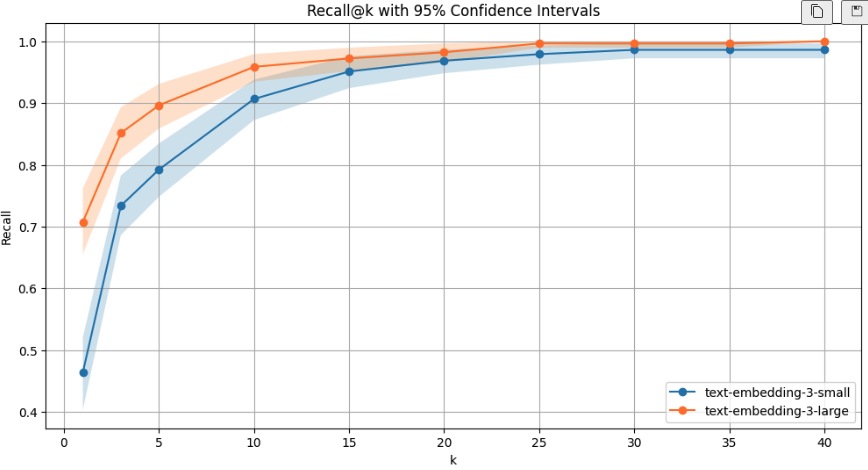

A recent [Mckinsey report](https://www.mckinsey.com/capabilities/quantumblack/our-insights/the-state-of-ai) reveals that 47% of C-suite leaders admit their companies are developing AI tools too slowly—even though 69% started investing over a year ago.

less than one in five saying their organizations are tracking KPIs for gen AI solutions.KPIs needed to be aligned with business metrics . What cannot be measured cannot be improved 

increasing engineering time because of  hesitation in being able to ship new features
[[change it]]Fast feedback loops are extremely under-rated when it comes to running experiments. Often times, they're the difference between some great results and a lot of frustration.
	A binary benchmark evaluation - Eg. Recall, MRR , Accuracy. In this case, you want to make sure that it's as easy for you to get your results
	A more subjective form of evaluation - I've found streamlit to be a great tool for this because you can scaffold out a simple interface in a few minutes and iterate as you go. With a decent interface, we can manually label a hundred or so samples reasonably fast and get a good sense for what makes a good response or not.

The ticket is not the feature - The ticket is the experiment - The outcome is learning 
 Schedule a weekly meeting to review key metrics with your entire team. 
Is your engineering teams wasting time working on the wrong things  

 Statistical testing and confidence are neccessary to validate that the improvements were real

 

What Does Increasing CI Overlap Mean in a Real-World Application?

In real-world applications, the increasing overlap of confidence intervals as k increases suggests that the performance difference between the two models becomes less meaningful at higher k values. Here’s what that could mean in different scenarios:

⸻

1. Information Retrieval (Search Engines, Recommendation Systems)
	•	Small k (e.g., top-5 results matter more)
	•	If you’re building a search engine or a recommendation system, users typically care about the top few results (e.g., first 5–10 search results).
	•	Since the models show a significant difference at lower k values, choosing the better model (orange, text-embedding-3-large) matters more in ensuring the most relevant results appear early.
	•	A user might click on a wrong result or miss relevant content if the weaker model is used.
	•	Large k (e.g., top-50 results matter less)
	•	If a user is browsing beyond the first page of search results (e.g., top-50), both models are almost equally good.
	•	The choice of model does not matter much anymore because both return nearly all relevant results.

Takeaway:
For applications where only a few top results matter (e.g., Google search, Netflix recommendations, or e-commerce rankings), the better-performing model at small k is crucial. But for bulk retrieval tasks (e.g., academic search, large document retrieval), either model works.

⸻

2. AI-Powered Assistants (Chatbots, Question-Answering)
	•	If an AI chatbot retrieves the top 3 most relevant answers, using the better model (orange) is important.
	•	If it fetches a long list of 30+ answers, both models perform similarly, so it doesn’t matter which one you use.

⸻

3. Fraud Detection / Anomaly Detection
	•	Suppose you’re using AI to detect fraudulent transactions.
	•	If the system flags only the top 5 suspicious transactions for review, you want the best model.
	•	If the system flags 50 transactions for investigation, both models are nearly the same.

⸻

Key Takeaways

✅ If decisions rely on only a few results (small k), model choice is critical.
✅ If many results are considered (large k), the difference between models is negligible.
✅ Choose the better model if precision in early rankings is crucial.